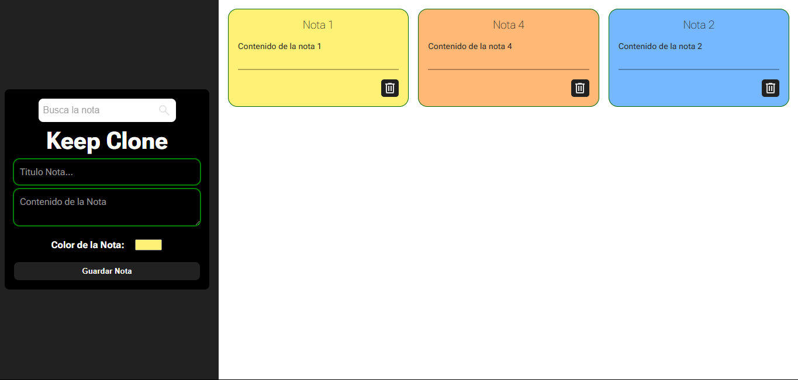

# 📘 Keep Clone

Clon sencillo de Google Keep desarrollado con Vite + Vanilla JavaScript, que permite crear, eliminar, mover, buscar y personalizar notas de forma dinámica y persistente.

## 🖼️ Vista previa



## 🚀 Funcionalidades

- ✅ Crear notas con título y contenido.
- 🎨 Asignar un color personalizado a cada nota.
- 🔎 Buscar notas por su título en tiempo real.
- 🗑 Eliminar notas individualmente.
- 💾 Persistencia local usando `localStorage`.
- 🧩 Interfaz responsive para dispositivos móviles.
- ✨ Efectos visuales como placeholders animados.

## 🧰 Tecnologías usadas

- [Vite](https://vitejs.dev/)
- HTML5 + CSS3
- Vanilla JavaScript
- localStorage

## 📦 Instalación

```bash
git clone https://github.com/MaoMachado/keep-clone.git
cd keep-clone
npm install
npm run dev
```

## 🤝 Autor

Mario Machado
GitHub: @MaoMachado
Este proyecto forma parte de mi portafolio como desarrollador frontend.
